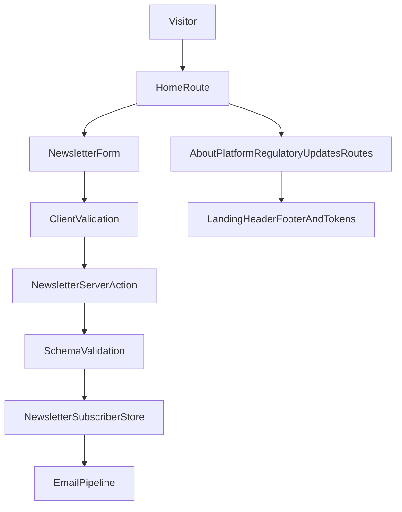

# Landing Architecture Plan

## Goal

Scale the current waitlist-first implementation into a five-page pre-launch website that preserves existing visual identity and infrastructure quality while replacing waitlist semantics with a compliance-safe newsletter and company preview model.

## Step-by-step execution

1. **Stabilize foundation and content model**
   - Keep current app-router locale structure in `app/[locale]`.
   - Introduce a clear content namespace split in message files (e.g. `Home`, `About`, `Platform`, `Regulatory`, `Updates`, `Newsletter`, `Common`).
   - Preserve existing metadata and locale routing in `app/[locale]/layout.tsx`.

2. **Create reusable landing shell and section primitives**
   - Keep `LandingHeader` and `LandingFooter` as the canonical frame.
   - Refactor repeated section scaffolding into reusable presentation blocks (hero, status strip, content section, card grid, CTA band).
   - Keep motion and visual language grounded in `app/globals.css` tokens/utilities.

3. **Replace waitlist interaction model with newsletter model**
   - Build a dedicated newsletter form component with fields:
     - first name
     - email
     - interest segmentation checkboxes
   - Remove nationality and referral UI from the new landing capture flow.
   - Keep robust validation and explicit success/error UX patterns from the current form architecture.

4. **Define scalable backend data flow**
   - Introduce a newsletter-specific server action contract (separate from waitlist semantics).
   - Add newsletter schema validation and typed payload handling.
   - Persist segmented interests as structured data for future CRM/email workflows.
   - Keep mailer integration for informational updates only.

5. **Implement pages in rollout order**
   - `Home / Company Preview` first (hero, status strip, opportunity, product teaser, newsletter).
   - `About Us` second (mission, team cards, board, advisors, closing CTAs).
   - `The Platform` third (problem statement, 4-step flow, disclaimer, contact CTA).
   - `Regulatory & Trust` fourth (compliance architecture + launch access policy).
   - `Updates / Newsroom` fifth (hero + newsletter anchor and initial update scaffolding).

6. **Build compliance-safe copy enforcement**
   - Apply phrase-guide constraints from `LandingPage_Proposal.md` across all CTA labels and section copy.
   - Ensure all product claims remain future tense.
   - Keep legal-critical status text visible and consistent on key pages.

7. **Navigation and route architecture**
   - Expand header navigation from a single-page shell to multi-route navigation.
   - Ensure route-level active states and cross-page CTA links (including newsletter anchors) work in both locales.
   - Keep footer policy/legal links intact.

8. **SEO and trust signals**
   - Add route-specific metadata for each new page.
   - Keep one H1 per page and semantic section hierarchy.
   - Add structured internal links between Home, About, Platform, Regulatory, and Updates.

9. **Quality gates before launch**
   - Run lint/typecheck/unit tests/qa.
   - Run compliance copy pass against forbidden phrase list.
   - Validate responsive layouts and core accessibility checks on each page.

10. **Migration and rollout safety**
    - Keep current waitlist path functional during transition if needed.
    - Deploy in phases: shell + Home, then remaining pages, then newsletter backend cutover.
    - Verify analytics/events and mail delivery after each phase.

## Target file map

- Routing/pages: `app/[locale]/page.tsx`, new routes under `app/[locale]/*`.
- Shared shell/UI: `components/landing/*`.
- Forms/actions/schemas: `components/*Form*`, `app/[locale]/actions.ts`, `schemas/*`.
- Localization: `messages/en.json`, `messages/es.json`.
- Styling tokens/utilities: `app/globals.css`.

## Architecture flow

